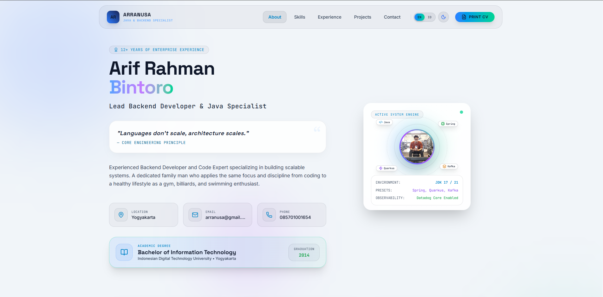

# 💼 Arif Rahman Bintoro — Portfolio

> **Live Site:** [arranusa.github.io](https://arranusa.github.io)

Personal portfolio website untuk **Arif Rahman Bintoro**, Lead Backend Developer & Java Specialist berbasis di Yogyakarta. Dibangun dengan React + TypeScript + Tailwind CSS dan di-deploy ke GitHub Pages.

---

## 🖥️ Preview



> Kunjungi langsung di: **https://arranusa.github.io**
>
> Tampilan: dark navy dengan aksen gold, layout responsif, navigasi smooth scroll, dan mode cetak (print) format CV A4.

---

## ✨ Fitur Utama

| Fitur | Keterangan |
|-------|-----------|
| 🌐 Bilingual | Konten tersedia dalam **Bahasa Indonesia** dan **English** |
| 🎨 Dark Theme | Desain dark navy modern dengan aksen gold elegan |
| 📱 Responsive | Optimal di desktop, tablet, dan mobile |
| 🖨️ Print / CV Mode | Tekan `Ctrl+P` untuk mencetak layout CV klasik format A4 |
| 🏗️ Interactive Architecture | Diagram arsitektur sistem backend yang interaktif |
| ⚡ Animasi Halus | Transisi dan animasi menggunakan Motion (Framer Motion) |
| 📍 Scroll Tracking | Navbar otomatis highlight section yang sedang aktif |

---

## 📄 Seksi / Halaman

- **About** — Profil singkat, pendidikan, dan informasi kontak
- **Skills** — Skill rating interaktif: Core Technologies, Database & Cloud, Security & Observability
- **Experience** — Timeline pengalaman kerja 10+ tahun (2014 – Sekarang)
- **Projects / Architecture** — Skenario arsitektur sistem enterprise yang nyata
- **Contact** — Form kontak dan tautan media sosial

---

## 🛠️ Tech Stack

### Portfolio Site
| Teknologi | Versi |
|-----------|-------|
| React | ^19.0.1 |
| TypeScript | ~5.8.2 |
| Tailwind CSS | ^4.1.14 |
| Vite | ^6.2.3 |
| Motion (Framer Motion) | ^12.23.24 |
| Lucide React | ^0.546.0 |

### Backend Expertise (Arif Rahman)
`Java` `Spring Boot` `Quarkus` `Microservices` `Apache Kafka`
`RESTful API` `SOAP` `PostgreSQL` `SQL Server` `Docker`
`Microsoft Azure` `Keycloak / JWT` `Datadog APM` `Application Insights`

---

## 📋 Pengalaman Kerja

| Perusahaan | Role | Periode |
|-----------|------|---------|
| PT Asuransi Jiwa IFG (IFG Life) | Lead Backend Developer | Oct 2022 – Present |
| PT AIA Financial | Backend Developer | Feb 2021 – Aug 2022 |
| PT Innovez One Indonesia | Java Backend Developer | Dec 2019 – Jan 2021 |
| PT Cerdas Digital Nusantara | Java Developer | Aug 2018 – Nov 2019 |
| PT Sarana Yukti Bandhana | Java Developer | Jan 2018 – Jul 2018 |
| PT Bank Sinarmas Tbk | Java Developer | Nov 2016 – Dec 2017 |
| PT Indonesia Comnets Plus (ICON+) | Java Developer | Apr 2014 – Sep 2016 |

---

## 🚀 Menjalankan Secara Lokal

### Prasyarat
- Node.js >= 18
- npm >= 9

### Instalasi & Development

```bash
# Clone repository
git clone https://github.com/arranusa/arranusa.github.io.git
cd arranusa.github.io

# Install dependencies
npm install

# Jalankan development server
npm run dev
```

Buka http://localhost:5173 di browser.

### Build Production

```bash
npm run build
```

Output build ada di folder `dist/`.

### Preview Build

```bash
npm run preview
```

### Deploy ke GitHub Pages

```bash
npm run deploy
```

Perintah ini otomatis menjalankan `build` terlebih dahulu (`predeploy`), lalu mempublikasikan folder `dist/` ke branch `gh-pages`.

### Perintah Lain

```bash
# Type checking
npm run lint

# Bersihkan folder dist
npm run clean
```

---

## 📁 Struktur Proyek

```
arranusa.github.io/
├── assets/              # Aset statis (gambar, file publik)
├── src/
│   ├── components/      # Komponen React
│   │   ├── AboutSection.tsx
│   │   ├── ContactSection.tsx
│   │   ├── ExperienceTimeline.tsx
│   │   ├── Navbar.tsx
│   │   ├── ProjectsSection.tsx
│   │   └── SkillsSection.tsx
│   ├── App.tsx          # Root component & print CV layout
│   ├── data.ts          # Data profil, skill, experience, projects
│   ├── types.ts         # TypeScript type definitions
│   ├── LanguageContext.tsx  # Context bilingual (ID/EN)
│   ├── ThemeContext.tsx     # Context dark/light theme
│   ├── main.tsx
│   └── index.css
├── index.html
├── vite.config.ts
├── tsconfig.json
└── package.json
```

---

## 📬 Kontak

| Platform | Link |
|----------|------|
| 🌐 Portfolio | [arranusa.github.io](https://arranusa.github.io) |
| 💼 LinkedIn | [linkedin.com/in/arranusa](https://linkedin.com/in/arranusa) |
| 🐙 GitHub | [github.com/arranusa](https://github.com/arranusa) |
| 📧 Email | arranusa@gmail.com |
| 📷 Instagram | [@arranusa](https://instagram.com/arranusa) |

---

## 📝 Lisensi

Personal portfolio — © 2025 Arif Rahman Bintoro. All rights reserved.
